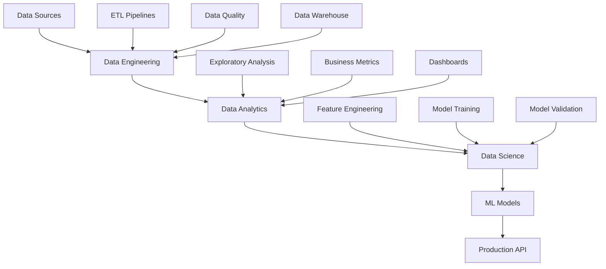

# 📊 Marketing Analytics - Fullstack Data Project

<div align="center">


*Um projeto completo de análise de marketing focado em LTV (Lifetime Value) e Churn Prediction*

</div>

## 🎯 Visão Geral

Este é um projeto **fullstack de dados** que abrange todo o ciclo de vida de um produto de dados, desde a engenharia de dados até a ciência de dados e análise. O objetivo principal é desenvolver modelos preditivos para **Customer Lifetime Value (LTV)** e **Churn Prediction** utilizando dados reais de e-commerce e telecomunicações.

### 🚧 Status Atual: Data Engineering
Atualmente, o projeto está na fase de **Data Engineering**, com foco na construção de pipelines de dados robustos e escaláveis.

## 🏗️ Arquitetura do Projeto



## 📁 Estrutura do Projeto

```
projeto_marketing_analytics/
├── 🗃️ src/
│   ├── 🔧 core/               # Configurações e infraestrutura
│   │   ├── database.py        # Conexões com banco de dados
│   │   └── settings.py        # Configurações do projeto
│   ├── 📊 data/               # Datasets
│   │   ├── Olist_customers/   # Dados de e-commerce brasileiro
│   │   └── Telco_customer_churn/ # Dados de churn de telecom
│   ├── 🏗️ models/             # Modelos de dados
│   │   ├── base.py           # Modelos base SQLAlchemy
│   │   └── logger.py         # Sistema de logs
│   └── 🔄 pipelines/          # Pipelines ETL/ELT
│       ├── olist/            # Pipeline Olist (Em desenvolvimento)
│       └── telco/            # Pipeline Telco (Ativo)
├── 🧪 tests/                  # Testes automatizados
├── 🔄 migrations/             # Migrações de banco de dados
├── 📋 scripts/                # Scripts de automação
├── 🐳 Docker-compose.yml      # Orquestração de containers
├── 📦 pyproject.toml          # Configurações e dependências
└── 📚 README.md               # Documentação
```

## 🎲 Datasets

### 1. 🇧🇷 Olist E-commerce Dataset
- **Fonte**: Olist (E-commerce brasileiro)
- **Período**: 2016-2018
- **Registros**: ~100k pedidos
- **Objetivo**: Análise de LTV e comportamento de compra

**Tabelas disponíveis:**
- `olist_customers_dataset.csv` - Dados dos clientes
- `olist_orders_dataset.csv` - Informações dos pedidos
- `olist_order_items_dataset.csv` - Itens dos pedidos
- `olist_order_payments_dataset.csv` - Pagamentos
- `olist_order_reviews_dataset.csv` - Avaliações
- `olist_products_dataset.csv` - Produtos
- `olist_sellers_dataset.csv` - Vendedores
- `olist_geolocation_dataset.csv` - Dados geográficos

### 2. 📞 Telco Customer Churn Dataset
- **Fonte**: Telco (Empresa de telecomunicações)
- **Registros**: ~7k clientes
- **Objetivo**: Predição de churn

**Principais features:**
- Informações demográficas
- Serviços contratados
- Informações de conta
- Histórico de churn

## 🛠️ Tecnologias Utilizadas

### Data Engineering
- **Python 3.12+** - Linguagem principal
- **Pandas & Polars** - Manipulação de dados
- **SQLAlchemy** - ORM e database toolkit
- **Alembic** - Migrações de banco de dados
- **SQLite** - Banco de dados (desenvolvimento)
- **PyArrow** - Processamento columnar

### DevOps & Tools
- **Docker** - Containerização
- **Poetry/UV** - Gerenciamento de dependências
- **Ruff** - Linting e formatação
- **Pytest** - Testes automatizados
- **Taskipy** - Automação de tarefas

### Futuras Implementações
- **FastAPI** - API REST (Data Science/Analytics)
- **Streamlit/Plotly** - Dashboards interativos
- **Scikit-learn/XGBoost** - Machine Learning
- **MLflow** - MLOps
- **PostgreSQL** - Banco de dados (produção)

## 🚀 Quick Start

### Pré-requisitos
- Python 3.12+
- UV (recomendado) ou Poetry

### 1. Clone o repositório
```bash
git clone https://github.com/zPaulo/projeto_marketing_analytics.git
cd projeto_marketing_analytics
```

### 2. Instale as dependências
```bash
# Com UV (recomendado)
uv sync

# Ou com Poetry
poetry install
```

### 3. Configure o banco de dados
```bash
# Execute as migrações
uv run alembic upgrade head
```

### 4. Execute o pipeline
```bash
# Execute o pipeline principal
uv run python src/main.py
```

## 🔄 Pipelines Implementados

### Pipeline Telco (✅ Ativo)
**Arquitetura ELT:**
1. **Extract** - Carrega dados do CSV
2. **Load** - Insere dados brutos no banco
3. **Transform** - Aplica limpeza e transformações

**Execução:**
```python
from src.pipelines.telco.pipeline import TelcoPipeline

pipeline = TelcoPipeline()
await pipeline.run_elt()
```

### Pipeline Olist (🚧 Em desenvolvimento)
- Extração de múltiplas tabelas
- Joins complexos entre entidades
- Cálculo de métricas de negócio

## 📊 Roadmap do Projeto

### 🎯 Fase 1: Data Engineering (Atual)
- [x] Estrutura base do projeto
- [x] Pipeline Telco implementado
- [x] Sistema de logs e monitoramento
- [x] Testes automatizados
- [ ] Pipeline Olist
- [ ] Data Quality checks
- [ ] Documentação completa das pipelines

### 🎯 Fase 2: Data Analytics
- [ ] Análise exploratória dos dados
- [ ] Métricas de negócio (LTV, Churn Rate, etc.)
- [ ] Dashboards interativos
- [ ] Reports automatizados

### 🎯 Fase 3: Data Science
- [ ] Feature Engineering avançado
- [ ] Modelos de Churn Prediction
- [ ] Modelos de LTV
- [ ] A/B Testing framework
- [ ] MLOps pipeline

### 🎯 Fase 4: Production
- [ ] API REST para modelos
- [ ] Interface web
- [ ] Monitoramento de modelos
- [ ] CI/CD completo

## 🧪 Testes

Execute os testes com:
```bash
# Todos os testes
uv run pytest

# Com coverage
uv run pytest --cov=src

# Específicos
uv run pytest tests/test_pipelines/
```

## 📝 Comandos Úteis

```bash
# Linting e formatação
uv run task lint
uv run task format

# Testes
uv run task test

# Migrações
uv run alembic revision --autogenerate -m "descrição"
uv run alembic upgrade head
```

## 🤝 Contribuindo

1. Faça um fork do projeto
2. Crie uma branch para sua feature (`git checkout -b feature/AmazingFeature`)
3. Commit suas mudanças (`git commit -m 'Add some AmazingFeature'`)
4. Push para a branch (`git push origin feature/AmazingFeature`)
5. Abra um Pull Request

## 📄 Licença

Este projeto está sob a licença MIT. Veja o arquivo [LICENSE](LICENSE) para mais detalhes.

## 📞 Contato

**Paulo** - [@zPaulo](https://github.com/zPaulo)

Link do Projeto: [https://github.com/zPaulo/projeto_marketing_analytics](https://github.com/zPaulo/projeto_marketing_analytics)

---

<div align="center">

**⭐ Se este projeto te ajudou, considere dar uma estrela!**

*Desenvolvido com ❤️ para a comunidade de dados*

</div>
